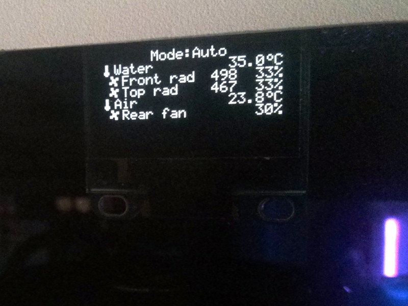
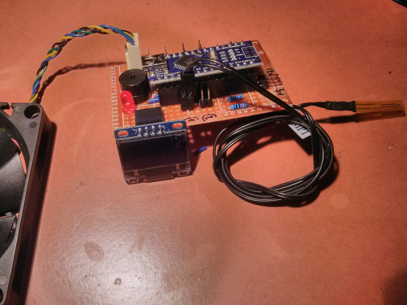

# Arduino fan controller

# Features
- Control fan speeds by using the following modes:
    + _Auto_: Use temperature->speed curves for each fan
    + _Low_: All fans sets to their lowest value on the curve (that is not 0)
    + _High_: All fans to their highest value on the curve (that is not 100)
    + _Full_: All fans to 100%
- SSD1306 Display:
    + Fan speed control mode
    + Sensor temperature
    + Fan speeds percent (with RPM if tachometer is available)
- Buzzer:
    - When there is no display: beep to transmit control mode and temperature
    - Beep when temperature is critical
- Warning led: Blink when in low speed mode (as temperature may rise)
- Button:
    + Short button press
        * Send control mode, temperatures and fan speeds to serial output
        * Beep first temperature (mix of morse and roman numbers)
            - `.`: 1, `..`: 2, `...`: 3, `.-`: 4, `-`: 5, `-.`: 6, `-..`: 7, `-...`: 8, `.--`: 9, `--`: 0
    + Long button press: Switch fan control modes
        * Auto (beep `.-`, morse code for A)
        * Low (beep `.-..`, morse code for L)
        * High (beep `....`, morse code for H)
        * Full (beep `..-.`, morse code for F)

# Setup

- Edit `config.cpp` to configure the different settings:
    + Pinout
    + Sensor list: pin
    + Fan list: pin, speed curve, associated sensor
    + SSD1306 display connection
    + ...

# Board

Perfboard design & photos in [board/](board/)

